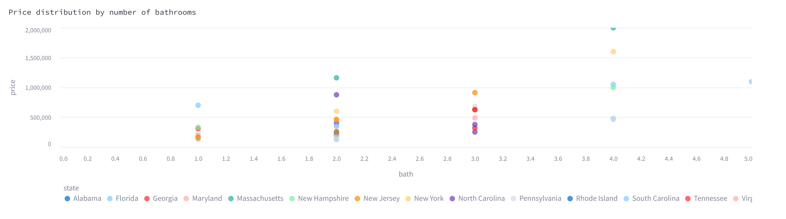

# marina-kaz-kafka_usa_real_estate_monitor
Real-time dashboard monitoring USA real estate object

## Idea

You know how Avito and other housing platforms provide not just information about the real estate properties, but also if its price is higher or lower than that of the market? 

Let's do something similar!

In this project, we use data about [USA Real Estate](https://www.kaggle.com/datasets/ahmedshahriarsakib/usa-real-estate-dataset/), explore it, clean it, fit a regression model to predict the price and build a distributed application to emulate real-time data processing. 


## Project structure 

* Data exploration and cleaning is located [here](./data/explore_data.ipynb). 
* The resulting table is located [here](./data/usa_real_estate.csv). It contains more than 100000 objects with the following features: state, city, house area, number of bathrooms, number of bedrooms and, finally, price.
* Model fitting is enclosed into a `Predictor` abstraction [here](./model/model.py). It is further used during application lifespan.
* Raw data producer, raw data consumer and processed data producer are all defined [here](./producers/producers.py). Notice how `Predictior` is used by `ProcessedDataProducer`, as well as `RawDataConsumer`.
* Visualization module is connected [here](./run_visualization.py). It contains processed data consumer, as well as launches web-application.


## Set Up Environment

```bash
python3 -m venv venv
source venv/bin/activate
pip install -r requirements.txt
```

## Run application

1. Launch kafka docker container

```
docker compose up
```


2. From another terminal, launch raw data production

```
python run_raw_data_production.py
```

This step will create multiple producers that read and send random data asynchronously.


Sample outpupt:
```
Produced raw sample: 135170
Produced raw sample: 66193
Produced raw sample: 172494
Produced raw sample: 176821
Produced raw sample: 119255
```

3. From another terminal, launch processed data production

```
python run_processed_data_production.py
```

This step will load and tune Random Forest model, read raw data, preprocess it and output predictions.
Fitting takes several seconds. 

Sample output:
```
Fitting model...
Approximation R2: 0.2903200580108557
Processed: 135170
Processed: 66193
```

4. From another terminal, launch data visualization.
```
streamlit run run_visualization.py
```

This will start real-time updating web application.

Sample output:
```
Vizualizer received {'prediction': 784431.1076415835, 'sample_id': 249743, 'bed': 4.0, 'bath': 4.0, 'city': 'Saint Augustine', 'state': 'Florida', 'house_size': 2862.0, 'price': 1049000.0}
Vizualizer received {'prediction': 506326.43205245043, 'sample_id': 180766, 'bed': 3.0, 'bath': 3.0, 'city': 'Rocky Mount', 'state': 'North Carolina', 'house_size': 1892.0, 'price': 249900.0}
Vizualizer received {'prediction': 481804.0645925105, 'sample_id': 103265, 'bed': 2.0, 'bath': 2.0, 'city': 'Pittsburgh', 'state': 'Pennsylvania', 'house_size': 704.0, 'price': 120000.0}
```

The web-application will constantly update charts according to the data received. 

The information displayed includes:
* Observed and predicted prices:


* Number of housings received by states:


* Price distribution by number of bedrooms:


* Price distrubution by number of bathrooms:

